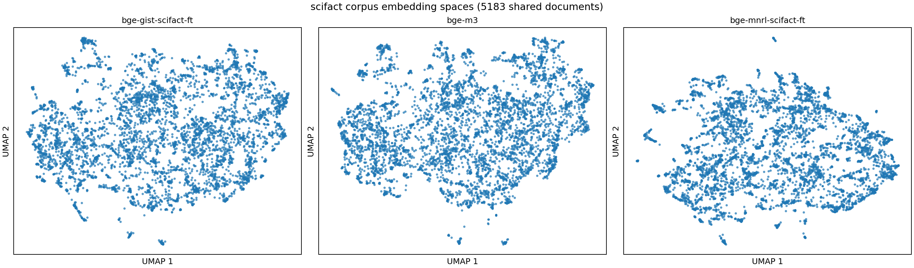

# Embedding Model Benchmarking Lab

A reproducible retrieval benchmark for comparing dense embedding models and a BM25 baseline on BEIR-style datasets. The project evaluates retrieval quality and encoding latency, visualizes corpus embedding spaces with UMAP, and compares two contrastive fine-tuning losses on SciFact.

## What This Project Does

The project answers three practical questions:

1. How do different retrieval models compare on the same labeled datasets?
2. How do dense models organize the same corpus in their embedding spaces?
3. Does domain fine-tuning improve retrieval, and does the training loss matter?

Implemented workflows:

- Benchmark dense local and API embedding models alongside BM25.
- Evaluate retrieval with cosine similarity, `MRR@10`, and `NDCG@10`.

- Generate side-by-side 2D UMAP plots for dense models on a shared document set.
- Build comparison CSV files only for dense models represented in a UMAP comparison.
- Fine-tune `BAAI/bge-base-en-v1.5` on SciFact with `MultipleNegativesRankingLoss` or `GISTEmbedLoss`.

## Repository Layout

```text
embedding-benchmark/
├── benchmarks/
│   ├── run_benchmark.py       # Dense and BM25 retrieval benchmark
│   ├── compare.py             # CSV summary for UMAP-included dense models
│   └── visualize_umap.py      # Side-by-side corpus UMAP visualizations
├── data/
│   ├── fiqa/                  # BEIR FIQA corpus, queries, and qrels
│   └── scifact/               # BEIR SciFact corpus, queries, and qrels
├── models/
│   ├── loader.py              # Dense embedders and BM25 retriever
│   ├── registry.py            # Benchmark model configuration
│   └── bge-*-scifact-ft/      # Saved fine-tuned models when generated
├── training/
│   └── train_adapter.py       # Fine-tuning and evaluation for SciFact
├── results/
│   ├── corpus_cache/<dataset>/ # Dense `.npz` vectors and BM25 `.pkl` indexes
│   ├── stats/                  # Per-run JSON metrics
│   ├── csv/                    # Comparison CSV exports
│   └── images/                 # UMAP images
├── notebooks/
│   └── final_report.ipynb
├── scripts/
│   └── download_data.py
└── requirements.txt
```

## Models

The benchmark keys currently configured in `models/registry.py` are:

| Model key | Implementation | Dimensionality | Notes |
| --- | --- | ---: | --- |
| `bge_m3` | `BAAI/bge-base-en-v1.5` via SentenceTransformers | 768 | Local dense encoder |
| `nomic_v1_5` | `nomic-ai/nomic-embed-text-v1.5` | 768 | Adds document/query task prefixes |
| `openai_3_small` | `text-embedding-3-small` | 1536 | Requires `OPENAI_API_KEY` |
| `cohere_en_v3` | `embed-english-v3.0` | 1024 | Requires `COHERE_API_KEY` |
| `bm25` | `rank-bm25` lexical retriever | N/A | Sparse non-embedding baseline |

Fine-tuned SciFact outputs are evaluated under keys such as:

- `bge_mnrl_scifact_ft`
- `bge_gist_scifact_ft`

## Setup

Use Python 3.10 or newer. The project is designed to run locally on CPU.

```bash
python -m venv .venv
source .venv/bin/activate
pip install --upgrade pip
pip install torch --index-url https://download.pytorch.org/whl/cpu
pip install -r requirements.txt
```

For API-backed embedding runs, create a `.env` file or export environment variables:

```bash
OPENAI_API_KEY=<your-key>
COHERE_API_KEY=<your-key>
```

## Datasets

Both included datasets use a BEIR-style layout:

```text
data/<dataset>/
  corpus.jsonl
  queries.jsonl
  qrels/
    train.tsv
    test.tsv
```

FIQA additionally provides `qrels/dev.tsv`.

| Dataset | Corpus documents | Queries | Evaluation split |
| --- | ---: | ---: | --- |
| SciFact | 5,183 | 1,109 | `qrels/test.tsv` |
| FIQA | 57,638 | 6,648 | `qrels/test.tsv` |

For evaluation, the harness embeds all corpus documents and only the queries appearing in the requested qrels split. The `train` split is used for fine-tuning, not for final benchmark scoring.

## Benchmark Pipeline

`benchmarks/run_benchmark.py` performs the full retrieval evaluation:

Run one dense model:

```bash
.venv/bin/python benchmarks/run_benchmark.py \
  --model bge_m3 \
  --dataset data/scifact \
  --split test \
  --batch-size 32 \
  --top-k 10
```

Run the BM25 baseline:

```bash
.venv/bin/python benchmarks/run_benchmark.py \
  --model bm25 \
  --dataset data/scifact \
  --split test \
  --top-k 10
```

Use limited runs while validating a new model:

```bash
.venv/bin/python benchmarks/run_benchmark.py \
  --model bge_m3 \
  --dataset data/fiqa \
  --split test \
  --limit-corpus 1000 \
  --limit-queries 50 \
  --batch-size 16
```

Per-run JSON output includes:

```json
{
  "dataset": "scifact",
  "split": "test",
  "model": "bge_m3",
  "embedding_dim": 768,
  "mrr_at_10": 0.0,
  "ndcg_at_10": 0.0,
  "avg_latency_per_embedding_ms": 0.0,
  "total_corpus_encode_time_sec": 0.0,
  "total_query_encode_time_sec": 0.0,
  "num_corpus_documents": 0,
  "num_queries": 0,
  "top_k": 10
}
```

Latency values depend on hardware, network/API conditions, batch size, and whether cached corpus vectors are reused.

## UMAP Visualization

`benchmarks/visualize_umap.py` discovers every dense `.npz` cache for one dataset, intersects their document IDs, and projects the same document sample through UMAP for a valid side-by-side comparison. BM25 is not included because it does not produce dense embedding vectors.

```bash
.venv/bin/python benchmarks/visualize_umap.py \
  --dataset scifact \
  --sample-size 1000 \
  --output results/images/scifact_umap.png
```

The default output path is `results/images/<dataset>_umap.png`.

## Comparison CSV

`benchmarks/compare.py` relates corpus cache filenames to metric JSON files. It includes only models that have `.npz` corpus embeddings available for UMAP, ensuring the table and the plotted dense models represent the same comparison set.

```bash
.venv/bin/python benchmarks/compare.py \
  --dataset scifact \
  --split test \
  --output results/csv/scifact_test_comparison.csv
```

BM25 metrics remain available in `results/stats/`, but BM25 is intentionally omitted from UMAP-filtered CSV files.

## Fine-Tuning Experiment

`training/train_adapter.py` builds positive `(query, relevant_document)` pairs from the SciFact training qrels and fine-tunes `BAAI/bge-base-en-v1.5`. It supports two losses with the same training pairs:

| Loss | Training behavior |
| --- | --- |
| `mnrl` | `MultipleNegativesRankingLoss` uses other documents in the batch as negatives. |
| `gist` | `GISTEmbedLoss` uses a fixed guide encoder to improve in-batch negative selection. |

Train and evaluate the MNRL variant:

```bash
.venv/bin/python training/train_adapter.py \
  --loss mnrl \
  --model bge_mnrl_scifact_ft
```

Train and evaluate the GIST variant:

```bash
.venv/bin/python training/train_adapter.py \
  --loss gist \
  --model bge_gist_scifact_ft
```

Both commands evaluate on SciFact `test` qrels after training and save a stats JSON plus a dense corpus cache, allowing the fine-tuned models to join the UMAP and CSV comparisons.

## Recorded Results

The current result artifacts report the following test performance.

### SciFact Test

| Model | MRR@10 | NDCG@10 | Dimension |
| --- | ---: | ---: | ---: |
| `bge_mnrl_scifact_ft` | 0.73162 | 0.76894 | 768 |
| `bge_gist_scifact_ft` | 0.72409 | 0.76412 | 768 |
| `bge_m3` | 0.70037 | 0.73763 | 768 |
| `openai_3_small` | 0.69223 | 0.72562 | 1536 |
| `cohere_en_v3` | 0.68342 | 0.71677 | 1024 |
| `nomic_v1_5` | 0.66665 | 0.70316 | 768 |
| `bm25` | 0.52422 | 0.55970 | N/A |

### FIQA Test

| Model | MRR@10 | NDCG@10 | Dimension |
| --- | ---: | ---: | ---: |
| `openai_3_small` | 0.52122 | 0.44845 | 1536 |
| `bge_m3` | 0.47397 | 0.39095 | 768 |
| `bm25` | 0.19854 | 0.15906 | N/A |

In the recorded SciFact experiment, both fine-tuning losses improve over the unfine-tuned dense baseline, with MNRL slightly ahead of GIST. In FIQA, `openai_3_small` is the strongest of the recorded evaluated models.




## Reproducing the Workflow

For a model and dataset combination:

```bash
.venv/bin/python benchmarks/run_benchmark.py --model <model_key> --dataset data/<dataset> --split test
.venv/bin/python benchmarks/visualize_umap.py --dataset <dataset> --sample-size 1000
.venv/bin/python benchmarks/compare.py --dataset <dataset> --split test
```

For the loss comparison experiment, run the two fine-tuning commands before regenerating the SciFact UMAP and comparison CSV.
